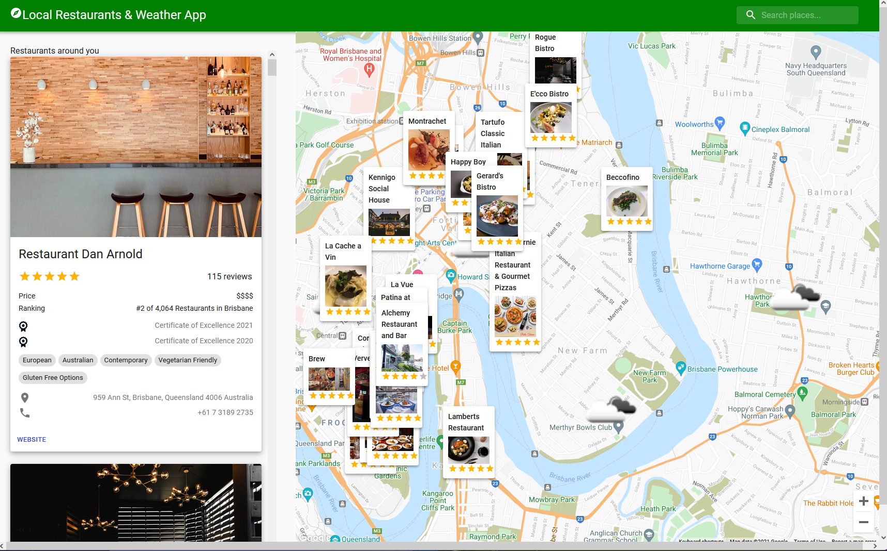

# mashup-api

<!--

<!-- PROJECT LOGO -->
 

  <h3 align="center">Mashup-API Application</h3>

<!-- ABOUT THE PROJECT -->
## About The Project

 

This is a Application is built for visitors and local people for discorvering the local restaurants and also the local weather status.

(<a href="#top">back to top</a>)

### Built With
* [React.js](https://reactjs.org/)
* [Express.js](https://expressjs.com/)
* Restaurant Adivisor API
* Weather API
* Google Map API

(<a href="#top">back to top</a>)

